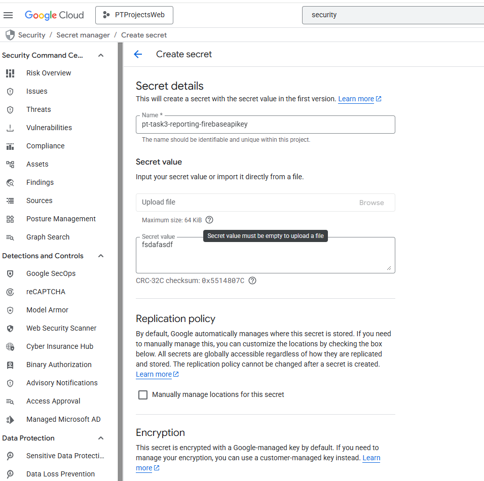

<!--Category:C#--> 
<p align="right">
    <a href="http://productivitytools.tech/"><a>
    <a href="https://github.com/ProductivityTools-Tasks3/ProductivityTools.GetTask3.Contract"></a>
</p>
<p align="center">
    <a href="http://http://productivitytools.tech/">
        
    </a>
</p>

# ProductivityTools.GetTask3.Reporting

Cloud function designed to generate and send markdown reports about finished tasks from the GetTask3 system.

<!--more-->

## Overview

**ProductivityTools.GetTask3.Reporting** is a serverless function (built using Google Cloud Functions Framework) that automates the process of tracking productivity. It fetches completed tasks and compiles them into a Markdown-formatted report, which is then emailed to the user.

### Key Features

- **Automated Reporting**: Runs periodically (e.g., every couple of hours) to generate up-to-date reports.
- **Markdown Reports**: Delivers reports in a clean, readable Markdown format.
- **Integration**:
  - Uses `ProductivityTools.GetTask3.Sdk` to communicate with the Task API.
  - specific email sending capability via `ProductivityTools.SentEmailGmail`.
- **Security**:
  - **API Authentication**: Protected via OAuth and Firebase Authentication.
  - **Secret Management**: Sensitive data like passwords and API keys are managed via `ProductivityTools.MasterConfiguration`.

## Configuration & Authentication

To function correctly, the application requires several configuration secrets. These are handled by `ProductivityTools.MasterConfiguration`, which retrieves values from a local file during development or Environment Variables in production.

### Required Secrets

1.  **Gmail Password**: Used to authenticate with the Gmail SMTP server for sending reports.
2.  **FirebaseWebApiKey**: Required to authenticate with the GetTask3 API.

> Note when running in Azure or Google Cloud, these values are populated from the environment variables.


## Deployment & Development

### Google Cloud Functions Setup

The project is configured for Google Cloud Functions. You can initialize and add dependencies using:

```bash
dotnet new gcf-http
dotnet add package ProductivityTools.GetTask3.Sdk
dotnet add package ProductivityTools.MasterConfiguration
```

### Known Issues & Troubleshooting

#### "Operation not supported" (NetworkInformationException)

A known issue exists when running .NET on hardened serverless Linux environments (like Google Cloud Run or Cloud Functions). The error `NetworkInformationException (95): Operation not supported` occurs because `.NET HttpClient` attempts to monitor network interface changes using low-level sockets restricted in the sandbox.

**Fix**:
The application includes a static constructor in the `Function` class to disable this behavior:

```csharp
static Function()
{
    Environment.SetEnvironmentVariable("DOTNET_NetworkChange_UNSUPPORTED", "true");
    Environment.SetEnvironmentVariable("DOTNET_SYSTEM_NET_HTTP_SOCKETSHTTPHANDLER_HTTP2SUPPORT", "false");
}
```

## Secret Manager

Configuration for secrets in the cloud environment:

